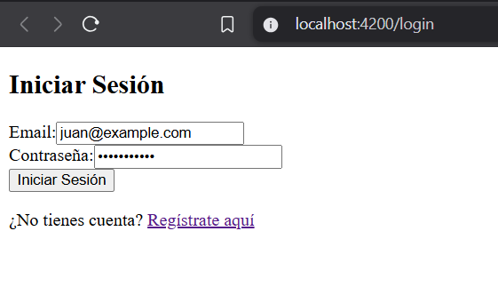
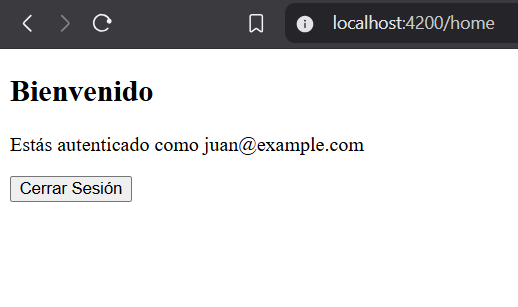
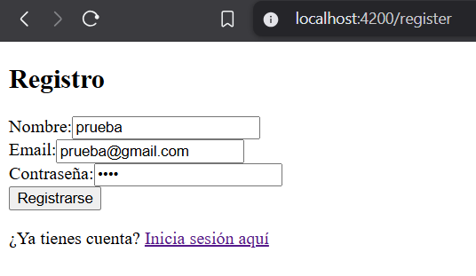
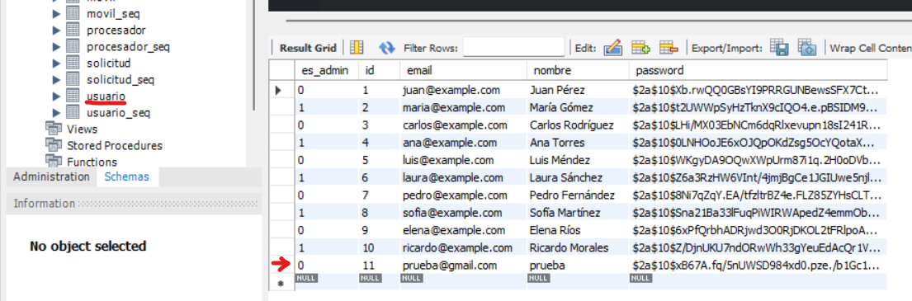

# Campeones25Angular
## Demostración de un sistema de Login y Registro con Angular y Spring

En este proyecto se presenta una pequeña demostración de un sistema de **inicio de sesión (login)** y **registro (register)** desarrollados con **Angular** en el frontend, conectados a un backend en **Spring** para validar su correcto funcionamiento.

### Login
- **Pantalla inicial de login**:  
    
- **Inicio de sesión exitoso**:  
    

### Register
- **Formulario de registro**:  
    
- **Confirmación del registro**:  
    
